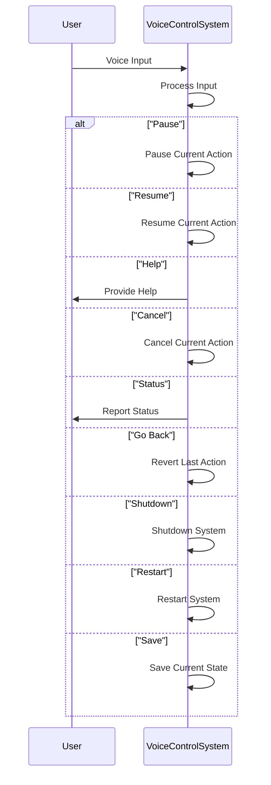

```mermaid
sequenceDiagram
    participant User
    participant VoiceControlSystem
    User->>VoiceControlSystem: Voice Input
    VoiceControlSystem->>VoiceControlSystem: Process Input
    alt "Pause"
        VoiceControlSystem->>VoiceControlSystem: Pause Current Action
    else "Resume"
        VoiceControlSystem->>VoiceControlSystem: Resume Current Action
    else "Help"
        VoiceControlSystem->>User: Provide Help
    else "Cancel"
        VoiceControlSystem->>VoiceControlSystem: Cancel Current Action
    else "Status"
        VoiceControlSystem->>User: Report Status
    else "Go Back"
        VoiceControlSystem->>VoiceControlSystem: Revert Last Action
    else "Shutdown"
        VoiceControlSystem->>VoiceControlSystem: Shutdown System
    else "Restart"
        VoiceControlSystem->>VoiceControlSystem: Restart System
    else "Save"
        VoiceControlSystem->>VoiceControlSystem: Save Current State
    end
```